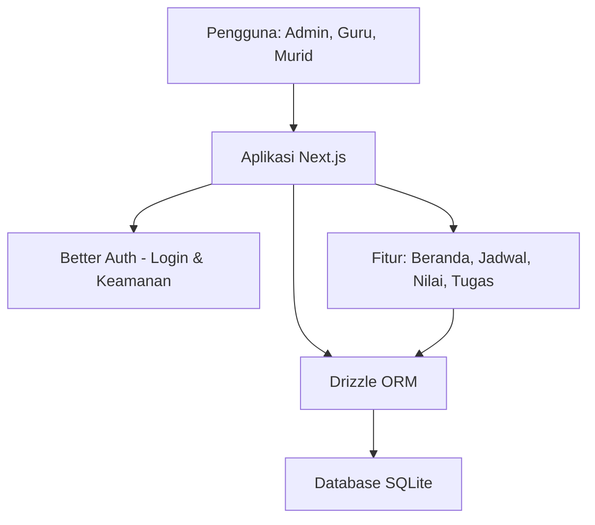
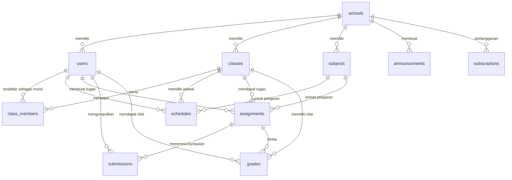

# PRD — Project Requirements Document

## 1. Overview

Sekolah saat ini mengelola jadwal, nilai, dan tugas secara manual menggunakan Excel. Data tersebar di banyak file, sering tidak sinkron, dan guru kesulitan memantau tugas mana yang sudah dikerjakan murid. Murid juga mudah ketinggalan informasi tugas karena tidak ada satu tempat terpusat.

Aplikasi ini adalah SaaS LMS (Learning Management System) untuk sekolah yang menyatukan jadwal pelajaran, input nilai, dan pengiriman tugas ke dalam satu platform yang rapi. Sekolah mendaftar, menambahkan guru dan murid, lalu semua aktivitas belajar-mengajar bisa dipantau dari satu dasbor. Biaya langganan dihitung otomatis berdasarkan jumlah murid dan guru yang dilayani, sehingga sekolah hanya membayar sesuai kebutuhan.

Tujuan utama: menggantikan catatan manual berbasis Excel dengan sistem digital yang terpusat, mudah digunakan, dan selalu memperlihatkan tugas-tugas yang harus dikerjakan.

## 2. Requirements

- Sekolah dapat mendaftar dan membuat akun untuk pertama kali.
- Sistem memiliki peran pengguna: admin sekolah, guru, dan murid.
- Guru dapat membuat jadwal pelajaran mingguan untuk setiap kelas.
- Guru dapat menginput nilai tugas maupun ulangan, melihat rekap, dan mengunduh nilai.
- Guru dapat mengirim tugas, menerima pengumpulan dari murid, dan memberi nilai/umpan balik.
- Murid dapat melihat jadwal, tugas, dan pengumuman, serta mengunggah jawaban tugas.
- Admin sekolah dapat mengelola akun murid dan guru, mengelompokkan kelas, dan melihat jumlah pengguna untuk perhitungan langganan.
- Sekolah dapat mengelola nama, logo, dan informasi sekolah.
- Sistem menampilkan paket langganan dan biaya berdasarkan jumlah pengguna aktif.
- Seluruh data tersimpan aman dan login dilindungi kata sandi.

## 3. Core Features

### Fase 1 — Beranda
- **Beranda** — Halaman utama yang merangkum semua aktivitas penting guru dan murid dalam satu layar.
  - **Ringkasan Aktivitas** — Menampilkan tugas terbaru, nilai, dan pengumuman secara ringkas.
  - **Jadwal Hari Ini** — Menampilkan daftar pelajaran dan jam mengajar/masuk sekolah pada hari tersebut.
  - **Tugas Mendesak** — Menyorot tugas yang perlu segera dikerjakan murid atau dinilai guru.

### Fase 2 — Jadwal Pelajaran, Input Nilai, Tugas & Pengumpulan
- **Jadwal Pelajaran** — Membuat dan mengelola jadwal mingguan untuk setiap kelas.
  - **Buat Jadwal** — Menyusun jadwal pelajaran dengan tampilan grid mingguan yang mudah digunakan.
  - **Atur Kelas** — Menambahkan kelas dan mata pelajaran yang akan dijadwalkan.
  - **Bagikan Jadwal** — Menampilkan jadwal kepada guru dan murid agar semua pihak mengetahui jam pelajaran.
- **Input Nilai** — Mencatat dan mengelola nilai murid.
  - **Catat Nilai** — Mengisi nilai tugas atau ulangan untuk seluruh murid dalam satu kelas.
  - **Rekap Nilai** — Melihat ringkasan nilai per murid dan rata-rata kelas.
  - **Unduh Nilai** — Mengekspor nilai ke file agar mudah disimpan atau dibagikan.
- **Tugas & Pengumpulan** — Mengirim tugas dan menerima hasil pengumpulan secara daring.
  - **Kirim Tugas** — Membuat tugas baru dan mengirimkannya ke murid.
  - **Kumpulkan Tugas** — Murid mengunggah jawaban tugas melalui aplikasi.
  - **Nilai Tugas** — Memberi nilai dan umpan balik pada tugas yang sudah dikumpulkan.

### Fase 3 — Pengguna & Kelas
- **Pengguna & Kelas** — Mengelola akun murid, guru, dan pembagian kelas.
  - **Daftar Murid & Guru** — Menambahkan atau menghapus akun murid dan guru.
  - **Kelola Kelas** — Mengelompokkan murid ke dalam kelas atau kelompok belajar.
  - **Hitung Pengguna** — Melihat jumlah murid dan guru untuk menyesuaikan paket langganan.

### Fase 4 — Akun & Pengaturan
- **Akun & Pengaturan** — Mendaftarkan sekolah, login, dan mengatur informasi sekolah.
  - **Daftar Akun Sekolah** — Mendaftarkan data sekolah saat pertama kali menggunakan aplikasi.
  - **Login & Logout** — Masuk dan keluar dari akun pengguna dengan aman.
  - **Pengaturan Sekolah** — Mengubah nama sekolah, logo, dan informasi umum lainnya.
  - **Manajemen Langganan** — Melihat dan mengelola paket berlangganan dan biaya berdasarkan jumlah murid, bukan jumlah pengguna, agar lebih adil bagi sekolah kecil dan lebih skalabel bagi sekolah besar.
    - **Paket Berdasarkan Jumlah Murid** — Menyediakan pilihan paket sesuai jumlah murid, misalnya hingga 100 murid, hingga 500 murid, atau tak terbatas.
    - **Integrasi Pembayaran** — Menggunakan Mayar.id untuk proses checkout dan pembayaran otomatis.
    - **Status Berlangganan** — Dashboard untuk melihat masa aktif paket dan riwayat pembayaran.

## 4. User Flow

1. **Pendaftaran Sekolah**  
   Admin mengunjungi aplikasi → memilih “Daftar” → mengisi nama sekolah, alamat, dan email → membuat akun admin → masuk ke dasbor sekolah.

2. **Menambahkan Pengguna & Kelas**  
   Admin membuka menu “Pengguna & Kelas” → menambahkan data guru dan murid (bisa manual atau salin dari Excel) → membuat kelas → memasukkan murid ke kelas masing-masing.

3. **Menyusun Jadwal**  
   Guru membuka menu “Jadwal Pelajaran” → memilih kelas → menambahkan mata pelajaran → menyusun jadwal mingguan pada grid → menyimpan dan membagikan kepada murid.

4. **Memberi Tugas**  
   Guru memilih kelas → membuat tugas baru → menulis judul, deskripsi, dan tenggat waktu → mengirim tugas ke murid. Murid melihat tugas di Beranda dan dapat mengunggah jawaban.

5. **Menilai Tugas & Menginput Nilai**  
   Guru membuka tugas yang sudah dikumpulkan → memberi nilai dan komentar → atau membuka menu “Input Nilai” untuk memasukkan nilai ulangan → melihat rekap → mengunduh nilai jika perlu.

6. **Memantau Aktivitas Harian**  
   Murid dan guru membuka Beranda → melihat jadwal hari ini, tugas mendesak, dan pengumuman terbaru.

7. **Mengelola Langganan**  
   Admin membuka menu “Kelola Langganan” → melihat jumlah pengguna aktif → memilih paket sesuai jumlah murid dan guru → melihat total biaya yang harus dibayar.

## 5. Architecture

Aplikasi dibangun sebagai satu project web full-stack menggunakan Next.js. Frontend dan backend berada dalam satu aplikasi, sehingga alur data lebih sederhana dan mudah dikelola. Autentikasi ditangani oleh Better Auth, sedangkan akses database menggunakan Drizzle ORM. Semua data disimpan dalam database SQLite.

Alur umum sistem:

Setiap aksi yang dilakukan pengguna, seperti membuat jadwal, mengirim tugas, atau mengisi nilai, akan diproses oleh aplikasi, divalidasi, dan disimpan ke database. Saat pengguna membuka halaman, aplikasi membaca data dari database dan menampilkannya secara rapi di layar.

## 6. Database Schema

Berikut tabel utama yang dibutuhkan untuk mendukung seluruh fitur:

- **schools** — menyimpan data sekolah yang mendaftar.
- **users** — menyimpan akun admin, guru, dan murid. Setiap pengguna terhubung ke satu sekolah dan memiliki peran (role).
- **classes** — menyimpan data kelas di sekolah.
- **class_members** — menghubungkan murid ke kelas masing-masing.
- **subjects** — menyimpan mata pelajaran yang diajarkan.
- **schedules** — menyimpan jadwal pelajaran per kelas, termasuk hari, jam, guru, dan mata pelajaran.
- **assignments** — menyimpan tugas yang dikirim guru ke murid.
- **submissions** — menyimpan jawaban tugas yang diunggah murid.
- **grades** — menyimpan nilai tugas atau ulangan untuk setiap murid.
- **announcements** — menyimpan pengumuman yang tampil di Beranda.
- **subscriptions** — menyimpan paket langganan dan biaya per sekolah.

Tabel **class_members** berguna untuk memisahkan murid dari guru saat menghitung jumlah pengguna, karena langganan dihitung berdasarkan jumlah murid dan guru. Tabel **grades** dapat terhubung ke tugas melalui `assignment_id`, atau berdiri sendiri untuk nilai ulangan harian.

## 7. Tech Stack

Rekomendasi teknologi untuk membangun aplikasi ini:

- **Frontend & Backend**: Next.js — satu framework untuk tampilan dan logika aplikasi.
- **Styling**: Tailwind CSS — memudahkan desain tampilan yang rapi dan responsif.
- **Komponen UI**: shadcn/ui — menyediakan komponen siap pakai seperti tombol, tabel, dan formulir.
- **Database**: SQLite — database ringan yang mudah disimpan dan dikelola.
- **Database Access**: Drizzle ORM — memudahkan membaca dan menulis data secara aman.
- **Autentikasi**: Better Auth — menangani login, logout, dan keamanan pengguna.
- **Deployment**: Vercel — platform untuk menjalankan aplikasi Next.js secara online.

Dengan stack ini, tim pengembang dapat membangun MVP dengan cepat, mudah dipelihara, dan biaya server tetap rendah saat masih tahap awal.

- **Payment Gateway**: Mayar.id — penyedia layanan pembayaran untuk memproses transaksi.